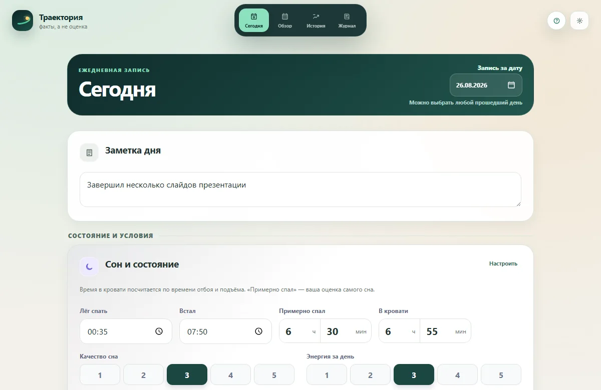
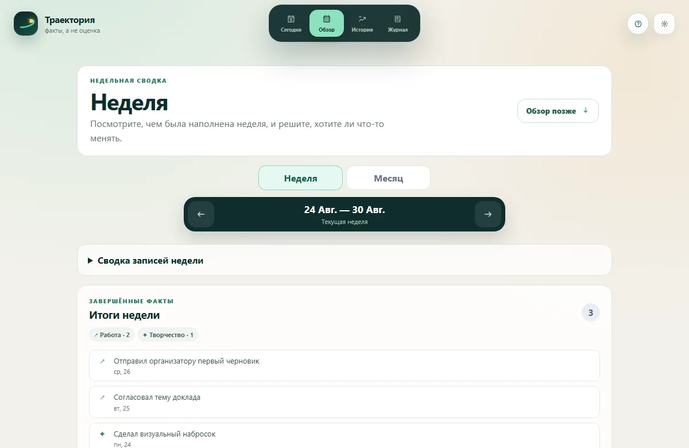

# Trajectory

**A personal journal that connects daily notes with weekly and monthly reflection.**

[Open Trajectory](https://trajectory-life.ru) · [Data policy](https://trajectory-life.ru/data-policy)

Record what happened, look back at the patterns, and decide what to try next. There is no score for a person or a day, and you choose which fields to use. The interface is in Russian.

## What you can do

- Keep a daily note and optional details about sleep, energy, activities, and the conditions around your day.
- Review a week or a month, save your observations, and choose a next step.
- Keep important events and completed results in a separate journal.
- Set a current goal, track concrete steps, and try a time-limited personal experiment.
- Explore changes over time with charts, search your history, and export or restore a JSON backup.
- Sync your account across devices and install the app as a PWA.





The screenshots use generated demonstration data.

## Data and privacy

Records are stored locally in IndexedDB and, when cloud sync is configured, in an account snapshot protected by Supabase Auth and row-level security. Administrators retain technical access; client-side encryption is not implemented.

The app does not automatically send your journal to an AI service. You choose what to export or copy. Product analytics are optional and require consent; event payloads exclude journal text and recorded values.

## Run locally

Requires Node.js 22.

```sh
npm ci
cp .env.example .env.local
npm run dev
```

The default configuration stores data in your browser and works without an account. For cloud sync, configure your own Supabase project with the supplied migrations and Edge Functions; set the corresponding values in `.env.local`. Keep service credentials out of `VITE_*` variables. Signup, feedback, and telemetry are disabled by default.

## Development

Built with Vue 3, TypeScript, Pinia, Vue Router, Dexie, Supabase, ECharts, and Vite. Vitest covers application logic; Playwright covers browser scenarios.

```sh
npm run check
npx playwright install chromium webkit
npm run test:e2e
```

`npm run landing:capture` refreshes the landing screenshots from deterministic synthetic data. `npm run storybook` opens the component catalogue.

[MIT License](LICENSE)
